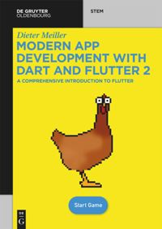

# Chicken Maze

This is the sample code for the book about dart and flutter programming.

This Branch is the newest and should work with the current version of flame.

It is a game written in flutter and dart.

There are no comments inside because all the explainations are inside the book.

The book is available at De Gruyter:

[Book](https://www.degruyter.com/document/doi/10.1515/9783110721331/html)

## Fun stuff

There is a [minimalist version of the game](https://github.com/Schnurber/hack_chicken_maze) for the hack platform.